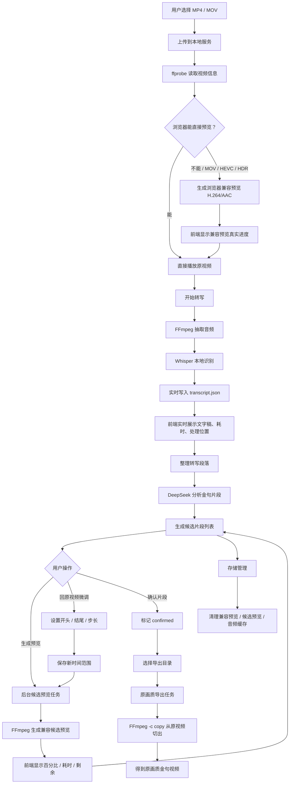

# MP4 金句片段筛选导出工作台完整复盘 SOP

更新时间：2026-07-31  
项目目录：`C:\Users\Neko\Documents\Codex\2026-07-30\mp4-deepseek-mp4-sop`  
当前本地服务：`http://127.0.0.1:8767/`

## 1. 最初构想

这个工具最初是给剪辑师做的本地网页工作台：上传长视频后，自动转写、用 DeepSeek 找金句、按时间范围拆候选片段、让用户预览和微调，最后导出精华短视频。

最核心的原则从一开始就确定了：预览可以压缩，但最终导出的金句视频必须从原视频直接裁切，画质和原素材一致。

最初需求包括：

1. 用户上传 MP4 视频。
2. 前端能预览原视频。
3. 本地转写视频音频，生成文字稿。
4. 把文字稿交给 DeepSeek 分析，筛选金句片段。
5. 根据 DeepSeek 给出的时间范围拆出候选视频。
6. 用户能预览每条候选视频，判断剪得好不好。
7. 用户确认后导出金句视频。
8. 最终导出的金句视频必须和原视频画质一致。

后来逐步扩展为：支持 MOV、兼容 HEVC/HDR、实时转写展示、候选预览进度、原视频微调、选择导出目录、删除重置清理、存储管理、后续打包和自动更新。

## 2. 当前已经做成的功能

### 2.1 上传与预览

已支持 MP4 / MOV 上传、原视频预览、视频元信息读取。如果浏览器不能正常显示画面，比如 MOV、HEVC、HDR、非 H.264，会生成浏览器兼容预览。

兼容预览只是给浏览器看的压缩版；最终导出不使用兼容预览，而是从原视频直接切。

### 2.2 兼容预览

已支持生成 H.264/AAC MP4，并优先使用硬件编码：

- NVIDIA：`h264_nvenc`
- Intel：`h264_qsv`
- AMD：`h264_amf`
- fallback：`libx264`

兼容预览已接入 FFmpeg 真实进度，前端显示百分比、耗时、预计剩余。当前预览策略约为 1280 宽、24fps、AAC 192k，画质不追求原画质，但尽量不糊到影响判断。

### 2.3 转写

已支持本地抽取音频、本地 Whisper 转写、前端实时显示转写过程和文字稿。前端会显示当前阶段、已用时间、已处理到视频哪个时间点、已产生多少段文字稿。

转写模式：

- 极速：base / beam 1
- 标准：small / beam 3
- 高精度：medium / beam 5
- 极致：large-v3-turbo / beam 5

转写分段不是严格“一句话一段”，而是 Whisper 根据语音活动、停顿和模型上下文切分。后续会整理为 transcript group，再交给 DeepSeek，减少碎片化。

### 2.4 DeepSeek 金句分析

已支持输入、保存、清除 DeepSeek API Key；可设置目标片段数、最短秒数、最长秒数。分析时优先使用整理后的文字稿分组，输出候选片段到前端。

### 2.5 候选片段预览

已支持单条生成和批量生成候选预览。批量并发数当前为 2。候选预览使用浏览器兼容 H.264/AAC，优先硬件编码，失败自动 fallback CPU。

候选预览已改为异步后台任务：前端立即拿到 `task_id`，轮询真实状态，显示真实百分比、耗时、预计剩余、编码器，并支持取消生成。

### 2.6 片段微调

每个候选片段可以回到原视频微调。前端支持当前画面设为开头、当前画面设为结尾、开头/结尾按自定义步长微调，默认步长 0.10s。保存时间后，该片段会标记为需要重新生成预览。

相比固定 `+0.5s / -0.5s`，自定义步长更适合口播和课程剪辑，因为 0.5s 对精剪来说偏粗。

### 2.7 最终导出

已支持单条导出、导出已确认片段、选择导出目录。导出目录可以是桌面、C 盘或任意文件夹。

导出也已改成异步任务：前端显示任务已加入队列、导出百分比、成功条数、失败条数、耗时。

最重要原则：最终导出使用原视频 stream copy：`-c copy`，不重新编码。因此最终金句视频画质和导入原视频一致，预览压缩不会影响最终成片。

### 2.8 删除、重置、清理

已支持重置当前视频、重新加载文字稿、清空文字稿显示、重置 DeepSeek 参数、选择/清空导出目录、删除单条候选、清空全部候选、重置时间、删除预览、清除导出记录。

存储管理已支持查看所有任务占用空间，并清理兼容预览、候选预览、音频缓存。默认不自动删除原视频，避免误删素材。

## 3. 中间踩过的坑与解决方案

### 3.1 地址打不开

早期端口不稳定，8765 和 8766 都遇到过占用。解决方案是固定使用 `8767`，当前访问地址为 `http://127.0.0.1:8767/`。

### 3.2 MOV / HEVC / HDR 只有声音没有画面

浏览器 video 标签不一定支持 MOV、HEVC/H.265、HDR 色彩格式，导致只有声音没有画面。解决方案是保留原视频，同时生成浏览器兼容 H.264/AAC 预览。

### 3.3 用户不知道兼容预览是否在生成

兼容预览可能耗时 10 分钟以上。解决方案是前端增加预览状态区，并接入 FFmpeg `-progress pipe:1` 显示真实进度、耗时和预计剩余。

### 3.4 上传状态和转写状态不一致

曾出现已经能转写但顶部还显示正在上传。解决方案是分离上传、预览、转写状态，并让前端定时轮询后端真实 job state。

### 3.5 转写没有实时文字

曾经必须刷新才能看到新文字。解决方案是后端每产生一个 Whisper segment 就写入 `transcript.json`，前端定时拉取并刷新完整文字稿。

### 3.6 文字稿只显示 500 段

长视频可能产生几千段，显示 500 段不够。解决方案是改为完整展示，并增加复制全部文字稿。

### 3.7 候选视频生成太慢

十几个候选视频串行生成会很慢，而且用户不知道卡在哪里。解决方案是候选预览并发数 2、优先硬件编码、预览质量适度压缩、后端异步任务化、前端显示真实进度并支持取消。

### 3.8 最终导出必须保持原画质

预览可以压缩，但最终金句视频不能损失画质。解决方案是预览和导出分两条链路：预览重编码为 H.264/AAC，导出从原视频 `-c copy` 直接切。

### 3.9 用户需要选择导出位置

默认导出到项目内部不够友好。解决方案是后端用 Tkinter 打开系统文件夹选择窗口，前端提供选择文件夹和清空按钮。

### 3.10 刷新后兼容预览是否丢失

兼容预览保存在 job 目录，`metadata.json` 记录 `browser_preview_file`，刷新后历史任务可以继续加载已有预览。

### 3.11 磁盘占用快速变大

一个 89 分钟视频源文件约 5.5GB，兼容预览接近 900MB，重复上传会很快占用十几 GB。解决方案是增加存储管理面板，显示每个任务占用，并支持清理缓存和预览。

### 3.12 中文乱码

Windows / PowerShell 编码导致部分中文写入后变成问号或乱码。解决方案是源码统一 UTF-8，新增中文尽量用 Unicode 转义写入，并在每次修改后扫描连续问号、替换符号以及常见 mojibake 字符。

## 4. 当前技术结构

后端主文件：`app.py`。职责包括静态文件服务、上传、媒体 Range 请求、ffprobe 元信息读取、FFmpeg 转码/切片/导出、Whisper 转写、DeepSeek 分析、任务状态管理、存储统计清理、导出目录弹窗。

前端主文件：`static/index.html`、`static/app.js`、`static/app.css`。职责包括上传、预览、转写状态展示、完整文字稿、DeepSeek 参数配置、候选片段展示、候选预览生成/取消/进度显示、原视频微调、确认片段、导出、存储管理。

主要数据结构：

- `data/jobs/{job_id}/metadata.json`
- `data/jobs/{job_id}/transcript.json`
- `data/jobs/{job_id}/transcript_grouped.json`
- `data/jobs/{job_id}/highlights.json`
- `data/jobs/{job_id}/browser-preview.mp4`
- `data/jobs/{job_id}/clips/preview/`
- `data/jobs/{job_id}/clips/exports/`

## 5. Workflow 图

配套清晰 PDF：`mp4-golden-clip-workflow-v2-no-overlap.pdf`

## 6. 当前推荐使用流程

1. 打开 `http://127.0.0.1:8767/`。
2. 上传 MP4 / MOV。
3. 如果视频黑屏但有声音，等待兼容预览生成完成。
4. 选择转写模式：极速适合快看，标准适合日常，高精度适合更准。
5. 点击开始转写。
6. 等文字稿实时跑完。
7. 输入 DeepSeek API Key。
8. 设置目标片段数、最短秒数、最长秒数。
9. 点击分析金句片段。
10. 对候选片段生成预览。
11. 如果片段开头结尾不准，点“回原视频微调”。
12. 确认满意片段。
13. 选择导出目录。
14. 导出单条或导出已确认片段。
15. 用存储管理清理不再需要的预览缓存。

## 7. 后续优化方向

- 统一任务队列：暂停、恢复、重试、失败原因、任务历史、任务恢复。
- 更强转写：WhisperX、faster-whisper、VAD、降噪、人声增强、说话人分离、自定义词表。
- 更聪明的金句筛选：观点金句、情绪金句、故事转折、传播标题、剪辑建议、传播分。
- 更专业的剪辑界面：波形图、字幕时间轴联动、拖拽裁切、快捷键、循环播放裁切范围。
- 桌面软件打包：Electron / Tauri / PySide，内置 FFmpeg、模型缓存、AppData 数据目录、自动更新、日志和崩溃恢复。
- 并行提速：根据 CPU/GPU 自动调整并发数，预览任务和转写任务分资源池，避免多个 FFmpeg 抢满磁盘 IO。

## 8. 给后续接手 AI 的注意事项

1. 不要把预览文件当最终导出源。
2. 最终导出必须继续使用原视频 `-c copy`。
3. 兼容预览和候选预览可以压缩，但音频要保持足够清晰。
4. 任何长耗时操作都必须有前端进度反馈。
5. 新增中文文案时注意 Windows 编码问题。
6. 修改后必须做 Python 编译检查、JS 语法检查、乱码扫描、至少一个 sample 接口测试。
7. 不要自动删除用户原视频素材。
8. 存储清理默认只清理缓存和预览。
9. 端口默认使用 `8767`。
10. 如果用户说“没反应”，优先检查后端服务、前端轮询、浏览器是否加载新版 `app.js?v=...`、是否有旧进程占用端口。

## 9. 当前状态一句话

这个项目已经从“上传视频后分析金句”的原型，推进到了一个可实际试用的本地剪辑筛选工作台：支持 MP4/MOV、兼容预览、实时转写、DeepSeek 金句分析、候选片段预览、原视频微调、原画质导出、异步进度反馈和存储管理。下一阶段重点应放在更强的任务队列、更准的转写、更专业的剪辑时间轴，以及桌面软件打包。
## 10. 工作台后续改进路线图

这一部分是基于当前工作台真实使用体验整理出的下一阶段优化建议。建议按“稳定性优先、效率第二、专业剪辑体验第三、打包商业化第四”的顺序推进。

### 10.1 P0：先把任务系统做稳

当前已经有异步任务雏形，但还不算完整任务队列。后续最优先要做统一任务中心。

建议改进：

1. 建立统一任务表：转写、兼容预览、候选预览、导出、DeepSeek 分析都进入同一任务系统。
2. 任务状态持久化：页面刷新后，前端能继续看到任务状态，不丢进度。
3. 支持取消、重试、失败原因展开。
4. 每个任务显示：当前阶段、百分比、已用时间、预计剩余、处理速度、错误日志。
5. 长任务互斥策略：避免转写、兼容预览、批量候选预览同时抢满 CPU/GPU/磁盘。

为什么要做：

- 用户最怕“点了没反应”。
- 当前长视频任务很多，任何无反馈都会让用户误判为卡死。
- 打包成软件后，任务恢复和错误日志会变得更重要。

验收标准：

- 刷新页面后仍能看到正在运行的任务。
- 任意耗时超过 3 秒的操作都有明确状态反馈。
- 候选预览失败后可以单条重试。
- 导出失败能看到失败原因，而不是只显示失败。

### 10.2 P0：保护原素材和最终画质

当前已经明确最终导出使用 `-c copy`，但后续需要在前端和后端继续强化这个原则。

建议改进：

1. 前端明确标识“预览画质”和“最终导出画质”是两条链路。
2. 导出前显示导出模式：原视频流复制，无重编码。
3. 对不适合 `-c copy` 精确切割的情况做提示：可能存在关键帧附近的轻微偏移。
4. 如果未来增加“精确帧级导出”，必须作为单独模式，并明确会重编码。
5. 默认永远不删除原视频，只允许用户手动确认删除。

为什么要做：

- 用户已经明确要求：最终金句视频必须和导入视频画质一模一样。
- 预览压缩可以接受，但不能污染导出链路。

验收标准：

- 导出文件元数据保留原视频编码时，前端显示“原画质无重编码”。
- 清理缓存不会删除原视频。
- 用户能明确知道自己导出的是预览版还是原画质版。

### 10.3 P1：提升转写准确率

当前 Whisper 本地转写可用，但准确率还有提升空间，尤其是长课、现场录音、多人发言、专业词汇。

建议改进：

1. 接入 faster-whisper，提高速度并更好利用 GPU。
2. 可选 WhisperX，对齐字幕时间戳，提高片段边界精度。
3. 增加 VAD 预切分，减少无效静音和噪声片段。
4. 增加音频预处理：降噪、人声增强、响度标准化。
5. 增加自定义词表：人名、品牌名、课程术语、行业词。
6. 支持说话人分离，至少标记“可能的不同说话人”。

为什么要做：

- 金句分析依赖文字稿质量。
- 文字越准，DeepSeek 选出来的时间段越有价值。
- 时间戳越准，候选片段越少需要人工微调。

验收标准：

- 同一条 90 分钟视频，转写错误率明显下降。
- 专有名词可通过词表纠正。
- DeepSeek 输出片段的开头结尾更接近真实语义边界。

### 10.4 P1：优化 DeepSeek 金句分析

当前 DeepSeek 能输出候选片段，但还可以更贴近剪辑师的判断方式。

建议改进：

1. 增加金句类型选择：观点金句、情绪共鸣、故事转折、课程重点、爆款标题、争议观点。
2. 每条候选片段输出剪辑建议：适合做开头、适合做标题、适合做转场、适合做结尾。
3. 增加传播评分：信息密度、情绪强度、独立可理解度、短视频开场力。
4. 支持二次筛选：用户删除不满意候选后，让 DeepSeek 补充新的候选。
5. 支持按平台风格分析：抖音、小红书、视频号、B站、课程精华。
6. 对候选片段做去重，避免多个片段表达同一个意思。

为什么要做：

- 剪辑师不是只要“句子好”，还要“能不能单独剪出来传播”。
- 当前金句筛选应逐步升级为“剪辑决策辅助”。

验收标准：

- 每条候选片段都有明确推荐理由和剪辑用途。
- 用户能按类型筛选候选片段。
- 同一视频输出的候选重复率降低。

### 10.5 P1：候选片段微调体验升级

当前已经支持回原视频微调，但还不是专业剪辑时间轴体验。

建议改进：

1. 增加波形图：用户能看到语音能量，快速判断停顿点。
2. 字幕与视频联动：点击文字稿句子，原视频跳到对应时间。
3. 候选片段范围可拖拽调整，而不是只靠输入框和按钮。
4. 增加循环播放当前候选片段。
5. 增加快捷键：
   - I：设置开头
   - O：设置结尾
   - J/K/L：后退/暂停/前进
   - 左右方向键：小步移动
   - Shift + 左右方向键：大步移动
6. 增加“前后留白”设置：例如自动给片段前后各留 0.1s、0.2s、0.3s。

为什么要做：

- 剪辑师判断片段好不好，最终靠画面、声音、停顿和语气。
- 当前按钮式微调可用，但效率还不够专业。

验收标准：

- 用户不输入时间码也能完成片段微调。
- 用户能快速循环播放调整后的范围。
- 微调后重新生成预览的入口清晰。

### 10.6 P1：批量效率和并行策略

当前候选预览并发数是 2，硬件编码优先。后续应该根据机器性能动态调整。

建议改进：

1. 启动时检测 CPU 核心数、GPU 编码器、可用内存、磁盘空间。
2. 自动推荐并发数：普通电脑 1-2，高性能电脑 2-4。
3. 转写和预览分资源池，避免同时占满 GPU。
4. 大视频分段转写，完成一段就先展示一段。
5. 候选预览按用户可见优先级生成：先生成屏幕上可见的候选，再生成后面的。
6. 空闲时自动预生成候选预览。

为什么要做：

- 长视频工作流里最耗时的是转写和预览生成。
- 不同用户电脑性能差异很大，固定并发不够聪明。

验收标准：

- 前端显示当前推荐并发策略。
- 用户可以手动调并发数。
- 批量候选预览不会把电脑卡死。

### 10.7 P2：历史任务和素材管理

当前有历史记录和存储管理，但还可以更像一个素材项目管理器。

建议改进：

1. 历史任务支持搜索、排序、筛选。
2. 显示任务状态：已上传、已转写、已分析、已导出。
3. 支持重命名任务。
4. 支持给任务加备注。
5. 支持删除整个任务，但必须二次确认，并明确会删除原视频。
6. 支持打开导出目录。
7. 支持导出项目包：metadata、文字稿、候选片段 JSON、SOP 信息。

为什么要做：

- 剪辑师可能同时处理多个视频。
- 长期使用后，历史任务会越来越多。

验收标准：

- 用户能快速找到某个历史视频。
- 用户能清楚知道每个任务占多少空间。
- 删除操作不会误伤原素材。

### 10.8 P2：打包成桌面软件

后续如果要交付给非技术用户，建议打包为桌面软件。

推荐架构：

1. 前端继续保留现有网页工作台。
2. 后端继续 Python，负责 FFmpeg、Whisper、DeepSeek、文件管理。
3. 外壳可选：Electron、Tauri、PySide / Qt WebEngine。
4. 数据目录迁移到用户 AppData，而不是项目目录。
5. 内置 FFmpeg / FFprobe。
6. Whisper 模型首次启动时下载或随安装包提供。
7. 增加日志目录和崩溃恢复。
8. 增加自动更新机制。

为什么要做：

- 当前网页本地服务适合开发验证。
- 真正给剪辑师使用时，需要一键打开、自动更新、少折腾环境。

验收标准：

- 用户双击软件即可打开工作台。
- 不需要手动启动 Python。
- 更新后保留历史任务和用户设置。
- 离线状态下仍可使用本地转写和导出。

### 10.9 P2：前端体验统一整理

随着功能变多，前端需要避免按钮越来越乱。

建议改进：

1. 顶部增加全局任务状态条。
2. 左侧固定为视频和文字稿，右侧固定为分析和候选片段。
3. 候选卡片分层：预览区、时间区、操作区、状态区。
4. 所有危险操作统一红色按钮，并二次确认。
5. 所有长任务按钮点击后立即进入 loading 状态。
6. 统一 toast 提示风格。
7. 错误信息不要只显示“失败”，要有下一步建议。

为什么要做：

- 这个工具已经从原型变成复杂工作台。
- UI 如果不整理，后续功能越多越难用。

验收标准：

- 用户不看说明也能完成完整流程。
- 每个区域都有清晰的状态和下一步动作。
- 删除、重置、导出、清理不会混淆。

### 10.10 推荐开发顺序

建议按以下顺序推进：

1. 统一任务队列和刷新恢复。
2. 转写准确率提升：faster-whisper、音频预处理、词表。
3. DeepSeek prompt 和金句评分升级。
4. 候选片段时间轴和波形微调。
5. 历史任务和素材管理。
6. 打包桌面软件。
7. 自动更新和日志系统。

这个顺序的逻辑是：先保证不丢任务、不误导用户，再提升识别和筛选质量，最后做专业剪辑体验和软件化交付。
## 11. 2026-07-31 任务中心 v1 改进记录

本轮已把路线图里的 P0“长任务透明化”往前推进了一步，新增了轻量任务中心。

### 11.1 已新增能力

1. 后端新增任务列表接口：`GET /api/tasks`。
2. 后端新增清理已完成任务接口：`POST /api/tasks/clear-finished`。
3. 前端新增“任务中心”面板，位于 DeepSeek 分析区和候选片段区之间。
4. 任务中心显示最近后台任务：候选预览、原画质导出。
5. 每个任务显示类型、标题、状态、百分比、耗时、消息和编码器。
6. 运行中的任务可以在任务中心直接取消。
7. 已完成、失败、已取消的任务记录可以一键清理。
8. 页面会每 2.5 秒自动刷新任务中心。

### 11.2 这次解决的问题

- 用户生成候选预览或导出时，不再只能看按钮状态。
- 多个后台任务并行时，用户能看到当前到底哪些任务在跑。
- 任务完成后，任务中心会从运行中状态变为已完成。
- 后续做统一任务队列时，前端已有任务中心入口，不需要再重新设计区域。

### 11.3 当前限制

- 任务列表目前主要保存在内存里，服务重启后任务中心记录会清空。
- 转写任务还没有完全纳入任务中心，仍使用原来的转写状态区。
- DeepSeek 分析任务还没有纳入统一任务列表。
- 任务日志还只是摘要级消息，没有展开完整 FFmpeg stderr。

### 11.4 下一步建议

1. 把转写任务纳入任务中心。
2. 把 DeepSeek 分析纳入任务中心。
3. 将任务状态持久化到 `data/runtime/tasks.json`，刷新和服务重启后都能恢复记录。
4. 增加“失败后重试”按钮。
5. 增加任务详情弹窗，展示错误日志、输入输出文件、耗时和资源占用。
## 12. 2026-07-31 任务中心持久化 v2 改进记录

本轮继续完善任务中心，把原本只存在内存里的后台任务记录持久化到了本地文件。

### 12.1 已新增能力

1. 新增任务记录文件：`data/runtime/tasks.json`。
2. 创建候选预览任务、导出任务时，会自动写入任务记录。
3. 任务进度变化、完成、失败、取消时，会同步更新任务记录。
4. 服务启动时会读取 `tasks.json`，恢复最近任务记录。
5. 如果服务重启前有运行中任务，启动后会标记为已中断，避免前端误以为还在运行。
6. 任务中心刷新后可以继续看到历史任务状态。

### 12.2 解决的问题

- 服务重启后任务中心不再完全空白。
- 用户可以看到最近生成过哪些候选预览或导出任务。
- 后续做任务恢复、失败重试、任务日志，有了本地持久化基础。

### 12.3 当前限制

- 目前持久化的是任务摘要，不是完整日志。
- 正在运行的 FFmpeg 任务无法在服务重启后继续，只能标记为中断。
- 转写任务和 DeepSeek 分析任务还没有纳入统一任务持久化系统。

### 12.4 下一步建议

1. 把转写任务也写入 `tasks.json`。
2. 把 DeepSeek 分析任务也写入 `tasks.json`。
3. 为失败任务增加“重试”按钮。
4. 为每个任务增加详情页，展示输入文件、输出文件、FFmpeg stderr、耗时和错误原因。
5. 定期裁剪旧任务记录，避免 `tasks.json` 无限增长。
## 13. 2026-07-31 任务中心重试 v3 改进记录

本轮继续完善任务中心，新增失败/取消任务的一键重试能力。

### 13.1 已新增能力

1. 新增后端接口：`POST /api/tasks/retry`。
2. 候选预览任务失败或取消后，可以在任务中心点击“重试”。
3. 原画质导出任务失败或取消后，也可以在任务中心点击“重试”。
4. 重试会创建一个新任务，并记录 `retry_of`，方便追踪它是从哪个旧任务重试而来。
5. 运行中的任务不能重试，避免重复占用资源。
6. 任务中心完成任务后，会同步更新候选卡片的 preview/export 状态。
7. 修复取消任务时的提示文案，从误导性的预览生成提示改为“正在取消任务”。

### 13.2 解决的问题

- 候选预览失败后不需要回到候选卡片重新找按钮。
- 导出失败后可以从任务中心直接重试。
- 服务重启导致的中断任务，后续也有了恢复操作入口。

### 13.3 当前限制

- 重试当前支持候选预览和原画质导出。
- 转写任务和 DeepSeek 分析还没有纳入任务中心重试。
- 重试不会自动删除旧失败任务记录，用户可以通过“清理已完成”清掉。

### 13.4 下一步建议

1. 把转写任务纳入任务中心。
2. 把 DeepSeek 分析任务纳入任务中心。
3. 为重试任务增加“来源任务”展示。
4. 为失败任务增加“查看详情”，展示错误日志和建议处理方式。

## 14. Task Center v4 - Transcription Tasks

Date: 2026-07-31

What changed:
- Local transcription is now registered as a background task with type `transcribe`.
- Task Center can show transcription status, percent, elapsed time, segment count, processed timestamp, model, and beam size.
- Start, pause, resume, stop, cancel, and retry actions are synchronized with the task record.
- Transcription task records are persisted in `data/runtime/tasks.json`, so users can still see task history after refresh or service restart.
- The task record does not store media content; it only stores job id, mode, model, status, progress, and timing metadata.

Why it matters:
- The user no longer needs to guess whether transcription is stuck.
- Refreshing the page no longer hides the current transcription state.
- Failed or cancelled transcription can be retried from Task Center.

Encoding note:
- A PowerShell/Windows encoding pitfall caused Chinese runtime strings to turn into mojibake.
- For now, new backend dynamic status messages use ASCII English to avoid `????` and corrupted text.
- A future improvement should introduce a dedicated UTF-8-safe UI message dictionary if full Chinese dynamic messages are required.

## 15. Task Center v5 - DeepSeek Analysis Tasks

Date: 2026-07-31

What changed:
- DeepSeek highlight analysis is now submitted as a background task with type `analyze`.
- The frontend no longer waits on a single blocking HTTP request. It submits the task, polls task status, and automatically renders candidate clips when the task completes.
- Task Center now shows analysis progress, elapsed time, and failure reasons.
- Retry support was added for analysis tasks.
- The DeepSeek prompt was rewritten in clean English instructions and explicitly asks the model to output Chinese `title`, `quote`, and `reason` fields.

Security decision:
- DeepSeek API Key is never persisted into Task Center records.
- `data/runtime/tasks.json` stores only safe analysis params: job id, target clip count, minimum seconds, and maximum seconds.
- Running analysis receives the key only in memory. Retried analysis reads the saved key from `user-settings.json` if the user chose to save it.

Verification:
- `python -m py_compile app.py` passed.
- `node --check static/app.js` passed.
- Common mojibake patterns and `????` were scanned in `app.py` and `static/app.js`.
- `/api/tasks` returned normal task records.
- A sample analysis task without transcript failed quickly with a visible error instead of appearing frozen.
- `data/runtime/tasks.json` was scanned for `sk-`, `api_key`, and `deepseek_api_key`; no key was found.

## 16. Frontend Task Sync Hotfix v6

Date: 2026-07-31

What changed:
- Fixed Task Center frontend mapping for `analyze` tasks. DeepSeek analysis tasks now display as `DeepSeek ??` instead of falling back to generic backend task text.
- Fixed `taskTitle()` for analysis tasks so they show a meaningful title: `??????`.
- Fixed `syncCompletedTasks()` so a completed analysis task can populate candidate clips even when the current candidate list is empty.
- Fixed a runtime bug in `pollRenderTask()` where analysis-sync code was accidentally inserted into clip preview polling and referenced an undefined `changed` variable.
- Bumped frontend script version to `rt18` so browsers load the repaired JavaScript.
- Removed temporary `_*.py` patch and inspection scripts from the project root.

Why it matters:
- Candidate preview generation no longer risks crashing when a preview task completes.
- DeepSeek background analysis results can appear automatically in the candidate list.
- Task Center is clearer and less confusing for editors watching long-running work.

Verification:
- `node --check static/app.js` passed.
- Direct code checks confirmed: `analyze` task type exists, analysis task title exists, the empty-candidate guard was removed, and `changed` is no longer referenced inside preview polling.
- `/api/tasks` still returns the existing `analyze` task record correctly.
- Project root temporary patch scripts were removed.

## 17. Task Persistence Throttle v7

Date: 2026-07-31

What changed:
- Added `TASK_PERSIST_MIN_INTERVAL = 0.75` and `persist_clip_tasks_throttled()`.
- `set_clip_task()` now throttles frequent running-progress writes to `data/runtime/tasks.json`.
- Terminal state changes such as done, error, cancelled, plus non-progress metadata updates, still persist immediately.

Why it matters:
- FFmpeg preview/export progress callbacks can fire several times per second.
- Long videos and batch preview jobs no longer rewrite the task persistence file on every progress tick.
- This reduces unnecessary disk I/O and makes the packaged desktop app more stable during long-running tasks.

Verification:
- `python -m py_compile app.py` passed.
- Local service restarted successfully on port 8767.
- `/api/tasks` returned normal persisted task records after restart.
- The main page returned HTTP 200.
- Direct code checks confirmed the throttle function, interval constant, and `set_clip_task()` integration exist.

## 18. Frontend HTML Escaping v8

Date: 2026-07-31

What changed:
- Added a shared `escapeHtml()` helper in `static/app.js`.
- Escaped external/untrusted text before rendering it through `innerHTML`, including:
  - DeepSeek clip title, quote, reason, type, confidence, and status text.
  - Task Center title, message, status, and encoder label.
  - Video metadata title/original filename.
  - Storage list job title/id/timestamp.
  - History list job title/timestamp.
  - Preview progress labels.
- Bumped frontend script version to `rt19`.

Why it matters:
- DeepSeek output and uploaded filenames should not be able to break the UI layout or inject HTML into the local workbench.
- This improves safety before packaging the tool as a desktop application.
- The user-facing behavior stays the same, but rendering is more robust.

Verification:
- `node --check static/app.js` passed.
- Direct checks confirmed `escapeHtml()` exists and key fields are escaped.
- Main page returned HTTP 200.
- `/api/tasks` returned normal task records.

## 19. Original Stream Export Verification v9

Date: 2026-07-31

What changed:
- Added backend `verify_stream_copy(source_path, export_path)` after final export.
- Final export still uses `-c copy` and does not re-encode video or audio.
- After export, the workbench now probes the source and exported clip, then compares:
  - video codec
  - width
  - height
  - pixel format
  - audio codec
- Each exported clip now records `export_verification` with `ok`, `checks`, `warnings`, `source`, and `export` fields.
- Candidate cards now show export verification status after export.
- Bumped frontend script version to `rt20`.

Why it matters:
- The user asked that final golden-quote videos preserve the same quality as the imported video.
- `-c copy` is the correct default for no-reencode exports, but the app now also verifies and reports whether the resulting stream metadata matches the source.
- This gives editors a concrete quality signal instead of only trusting that export finished.

Important tradeoff:
- Original stream copy preserves quality but may cut on codec/keyframe boundaries.
- Frame-perfect arbitrary cuts require re-encoding, which cannot be exactly identical to the source stream.
- The current product choice remains: default final export prioritizes original stream quality.

Verification:
- `python -m py_compile app.py` passed.
- `node --check static/app.js` passed.
- Local service restarted successfully.
- A small sample export task completed successfully.
- The exported sample clip recorded `export_verification.ok = true` and matching source/export codec, resolution, pixel format, and audio codec.

## 20. Workbench Health Check v10

Date: 2026-07-31

What changed:
- Added backend `GET /api/health`.
- Added frontend `????` panel with refresh button.
- Health check now reports:
  - FFmpeg availability and version.
  - FFprobe availability and version.
  - Preview encoder and whether hardware encoding is available.
  - Local Whisper dependency import status.
  - DeepSeek Key saved/not saved status.
  - Free disk space for the workbench data directory.
- Bumped frontend script version to `rt21`.

Why it matters:
- Editors should know before starting a long job whether the local environment can transcribe, preview, analyze, and export.
- This avoids the user clicking `????` and waiting with no useful explanation when a dependency is missing.
- It is also a packaging checklist for the future desktop app.

Verification:
- `python -m py_compile app.py` passed.
- `node --check static/app.js` passed.
- Local service restarted successfully.
- `GET /api/health` returned real environment data.
- Main page returned HTTP 200.

Current observed environment:
- FFmpeg: OK, version 8.1.1.
- FFprobe: OK, version 8.1.1.
- Preview encoder: OK, NVIDIA hardware encoder `h264_nvenc`.
- DeepSeek Key: saved.
- Disk space: OK, about 646 GB free on the data drive.
- Local Whisper: missing in the currently running Python environment: `No module named 'faster_whisper'`.

Follow-up packaging note:
- The desktop package must include or install `faster-whisper` and its runtime dependencies, otherwise local transcription cannot work even though upload, preview, DeepSeek analysis, and export may work.

## 21. Dependency Bootstrap v11

Date: 2026-07-31

What changed:
- Rewrote `start.bat` as ASCII-safe text to avoid mojibake in Windows console.
- `start.bat` now checks whether `faster_whisper` and `opencc` can be imported before launching the server, and tells the user to run `install-deps.bat` if dependencies are missing.
- Added `install-deps.bat`:
  - Prints the Python executable being used.
  - Upgrades pip.
  - Installs `requirements.txt` into that Python environment.
- Added `dependency-check.bat` for a quick local dependency check.
- `/api/health` now includes:
  - current `sys.executable`
  - `requirements.txt` path
  - dependency install command when `faster-whisper` is missing
- The frontend health panel now displays Python path and install command for missing dependencies.
- Bumped frontend script version to `rt22`.

Why it matters:
- The workbench previously detected that `faster-whisper` was missing, but did not give a clear action path.
- Users and future packaging scripts now have a concrete dependency installation path.
- This reduces the chance that transcription fails only after a long upload/preparation step.

Verification:
- `python -m py_compile app.py` passed.
- `node --check static/app.js` passed.
- Local service restarted successfully.
- `/api/health` returned Python path, requirements path, and install command.
- Main page returned HTTP 200.
- `install-deps.bat` and `dependency-check.bat` exist and are readable ASCII.

Current environment note:
- The active service Python is `C:\Users\Neko\.cache\codex-runtimes\codex-primary-runtime\dependencies\python\python.exe`.
- Health check still reports `faster-whisper` missing until dependencies are installed into that exact Python environment or the packaged app bundles them.

## 22. Local Transcription Dependency Activation v12

Date: 2026-07-31

What changed:
- Installed transcription dependencies into the exact Python used by the running service:
  - `opencc-python-reimplemented==0.1.7`
  - `faster-whisper==1.2.1`
  - related runtime packages such as `ctranslate2`, `onnxruntime`, `av`, `huggingface-hub`, and `tokenizers`.
- Restarted the local service so `/api/health` and transcription workers use the updated environment.
- Updated transcription completion messaging for the 0-segment case:
  - If speech segments are detected: `Transcription complete. Ready for highlight analysis`.
  - If no segments are detected: `Transcription complete, but no speech segments were detected`.

Installation notes:
- Running `pip install -r requirements.txt` initially timed out after 120 seconds.
- Installing `opencc-python-reimplemented` separately succeeded quickly.
- Installing `faster-whisper>=1.0.0` separately with a longer timeout succeeded after downloading larger wheels.

Verification:
- Direct import check passed:
  - `faster_whisper 1.2.1`
  - `opencc ok`
- `/api/health` is now fully green with `warning_count = 0`.
- Main page returned HTTP 200.
- A 3-second sample transcription task completed through the workbench API using mode `fast` / model `base`.
- The sample produced 0 transcript segments, likely because the tiny sample does not contain recognizable speech; the completion message logic was improved accordingly.

Current environment:
- Active service Python: `C:\Users\Neko\.cache\codex-runtimes\codex-primary-runtime\dependencies\python\python.exe`.
- Local Whisper dependency status: OK.
- This removes the previous hard blocker where `????` would fail immediately due to `No module named 'faster_whisper'`.

## 23. Single Clip Export Folder Picker v13

Date: 2026-07-31

User requirement:
- When exporting a single golden-quote clip, the user should be able to choose where to put it through a system folder picker, such as Desktop, C drive, or any custom folder.
- The user should not have to type the path manually.

What changed:
- Added frontend `pickExportDirectory(initialDir)` helper that calls the existing backend `/api/dialog/export-dir` endpoint.
- Added `exportSingleClip(clipId)`.
- Candidate card `????` button now calls `exportSingleClip(clip.id)` instead of directly calling `exportClips([clip.id])`.
- Single clip export now opens the system folder selection window first.
- If the user cancels the picker, export is cancelled cleanly.
- If the user selects a folder, the selected path is also copied into the export directory input for visibility/reuse.
- Batch export (`???????`) still uses the export directory input field as before.
- Bumped frontend script version to `rt23`.

Verification:
- `node --check static/app.js` passed.
- Main page returned HTTP 200.
- Static checks confirmed:
  - `pickExportDirectory()` exists.
  - `exportSingleClip()` exists.
  - single clip export button calls `exportSingleClip(clip.id)`.
  - batch export button still calls `exportClips()`.
  - page loads `app.js?v=rt23`.

Manual note:
- I did not automatically open the folder picker during verification to avoid interrupting the user's desktop with a system dialog.
- The code path uses the already-existing Tkinter `askdirectory()` backend endpoint, which supports choosing Desktop, C drive, or any normal folder visible to Windows.

## 2026-07-31 修复：原视频微调生成预览误覆盖/顶掉候选片段

### 现象
在原视频区域选择“生成这条预览/剪切预览”时，用户反馈会把第 10 条候选片段顶掉或覆盖，属于候选片段回写错位风险。

### 原因判断
当前数据中的 10 条候选 ID 没有重复，但旧版逻辑存在两个隐患：
1. 前端任务中心会同步最近完成任务，旧任务可能把候选列表刷回旧状态。
2. DeepSeek 返回的候选如果自带重复或异常 id，后端会保留，后续按 id 更新就可能写错片段。

### 已处理
1. 前端新增 `replaceClipById()`，所有预览、导出、时间保存回写都必须通过 clip_id 校验；返回 id 和当前处理 id 不一致时直接拦截并提示。
2. 前端新增 `trackedTaskIds` / `syncedTaskIds`，任务中心只自动回写当前页面追踪中的任务，避免历史完成任务反复覆盖候选列表。
3. 原视频微调区标题显示“正在微调第 N 条”，生成预览时锁定当前 clip_id，并在生成中禁用按钮，避免误操作。
4. 后端新增 `normalize_highlights()`，读取/保存候选时自动修复缺失或重复 id；DeepSeek 分析产物统一生成 `clip_001`、`clip_002` 这种稳定 id。
5. 前端版本号升级到 `app.js?v=rt24`，避免浏览器缓存旧逻辑。

### 验证
- `python -m py_compile app.py` 通过。
- `node --check static/app.js` 通过。
- 本地服务重启后 `http://127.0.0.1:8767/` 返回 200。
- 已有任务候选数据复查：当前 10 条候选无重复 id。

## 2026-07-31 修复：原视频自由剪切生成预览无反馈

### 现象
用户在原视频区域自行设置剪切范围后点击“生成这条预览”，前端看起来没有反应。

### 原因
旧逻辑默认该区域只服务于“从候选片段返回原视频微调”的流程，必须已经绑定某条候选 `clip_id`。用户直接在原视频里自由剪切时没有候选绑定，按钮缺少明确提示，也不能自动创建手动候选。

### 已处理
1. 新增后端 `/api/clips/manual`，可根据原视频起止时间创建 `manual_trim` 手动候选。
2. 前端上传/加载视频后直接显示“原视频自由剪切”区。
3. 没有绑定候选时点击“生成这条预览”，会自动创建一条手动候选，再提交兼容预览生成任务。
4. “生成这条预览”和“保存剪切时间”都增加异常提示，未上传到本地服务时会明确提示先上传。
5. 前端缓存版本升级到 `app.js?v=rt26`。

