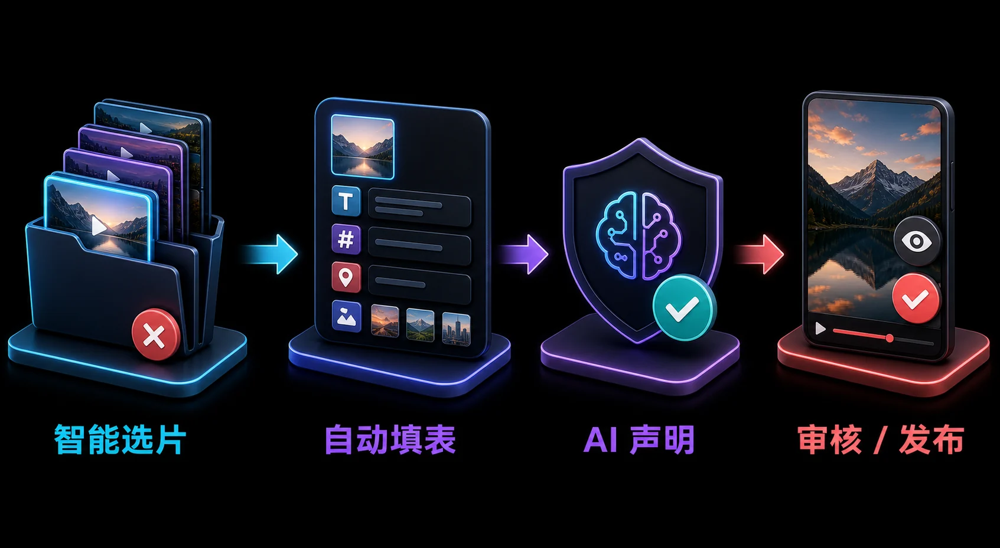

<!-- README-PROMO:START -->
<p align="center">
  
  
  
</p>
<!-- README-PROMO:END -->

# 🎬 抖音视频自动发布工具 · Douyin Auto Video Publisher

[](https://opensource.org/licenses/MIT)
[]()
[]()

> 🇨🇳 全自动抖音视频发布工具：选片 → 上传 → 填表 → AI声明 → 发布，全流程自动化。  
> 🇺🇸 Fully automated Douyin (TikTok China) video publisher: select → upload → fill form → AI declaration → publish, end-to-end automation.

---

## ✨ 功能 · Features

- 📁 **智能选片** — 按文件名排序轮换，已发布自动标记`（已发）`，永不复用  
  **Smart video selection** — auto-rotate by filename, mark published with `（已发）` suffix, never reuse
- 🎬 **一键上传** — Playwright + CDP 驱动 Chrome，绕过反爬检测  
  **One-click upload** — Playwright + CDP drives Chrome, bypasses anti-bot detection
- ✍️ **全自动填表** — 标题 / 正文 / 话题标签 / 地理位置 / 封面 / 保存权限  
  **Auto form filling** — title / body / hashtags / location / cover image / save permissions
- 🤖 **AI 声明勾选** — 三方案降级策略，100% 可靠勾选"内容由 AI 生成"  
  **AI declaration** — 3-tier fallback strategy, 100% reliable "AI-generated content" checkbox
- 🚀 **支持自动发布** — `--publish` 一键走完流程，或默认停在发布页等待人工审核  
  **Auto-publish mode** — `--publish` for full automation, or pause for manual review
- 🕵️ **反检测策略** — 随机间隔、拟人打字、鼠标移动模拟，60-120 秒真人节奏  
  **Anti-detection** — randomized delays, human-like typing, mouse movement simulation
- ⏰ **支持定时调度** — 配合 cron / Kanban 实现每日定时发布  
  **Scheduled publishing** — works with cron / Kanban for daily timed posts

---

## 🚀 快速开始 · Quick Start

### 环境要求 · Requirements

- **Windows** （macOS/Linux 修改路径即可）  
- **Python 3.12+**
- **Chrome / Chromium** 浏览器
- **抖音创作者账号** 已登录

### 安装 · Installation

```bash
pip install playwright
playwright install chromium
```

### 配置 · Configuration

1. 登录抖音创作者中心 `https://creator.douyin.com`  
   Log in to Douyin Creator Center

2. 保存登录状态：  
   Save login state to `~/.hermes/browser-profiles/douyin_state.json`

3. 准备视频素材目录，放入 `.mp4` 文件  
   Prepare video directory with `.mp4` files

### 运行 · Run

```bash
# 默认模式：填表后停在发布页等待审核
# Default: fill form, pause for manual review
python scripts/dy_video_post.py

# 自动发布模式：填表后自动点击发布
# Auto-publish: fill form + auto-publish
python scripts/dy_video_post.py --publish

# 指定第 N 个可选视频
# Specify Nth available video
python scripts/dy_video_post.py --index 0 --count 2 --publish
```

---

## 📖 架构 · Architecture

```
dy_video_post.py      ← 主入口，选片 + 文案轮换
        ↓
dy_video_publish.py   ← 浏览器自动化，Playwright + CDP
        ↓
douyin_state.json     ← 浏览器登录态持久化
```

| 模块 Module | 功能 Function |
|-------------|---------------|
| `dy_video_post.py` | 选片、文案模板轮换、状态管理 |
| `dy_video_publish.py` | Playwright 浏览器自动化、表单填写、发布 |
| `douyin_state.json` | 抖音登录 Cookie 持久化 |

---

## 🔧 表单自动化详情 · Form Automation Details

| 字段 Field | 方法 Method | 说明 Note |
|------------|-------------|-----------|
| 📝 标题 Title | `input.fill()` | ≤30 字，两套模板轮换 |
| 📄 正文 Body | `contenteditable` 逐行拟人打字 | ~1000 字限制 |
| #️⃣ 话题标签 Hashtags | 点击 `#添加话题` → 输入 → Enter | 5 个标签 |
| 📍 位置 Location | 点击 `输入地理位置` → 打字 → ArrowDown → Enter | 搜索式输入 |
| 🖼️ 封面 Cover | 点击 AI 推荐第一张 → 确认弹窗 | 自动处理 |
| 🔒 保存权限 | 选中"不允许" radio | 禁止下载 |
| 🤖 AI 声明 | 三步降级：force_click → nativeInputValueSetter → 全链点击 | 100% 可靠 |
| 🚀 发布按钮 | 精确匹配 `^发布$` (排除"高清发布") | JS 兜底 |

---

## 🛡️ 反检测策略 · Anti-Detection

| 措施 Measure | 说明 Description |
|-------------|-----------------|
| `headless=false` | 可见浏览器窗口 |
| `--disable-blink-features=AutomationControlled` | 禁用自动化标记 |
| 随机间隔 Randomized delays | 300ms ~ 2000ms |
| 拟人打字 Human-like typing | 每字 60-120ms，5% 卡顿 |
| 鼠标模拟 Mouse simulation | 随机起点非直线移动 |

---

## ⚠️ 故障排查 · Troubleshooting

### AI 声明勾选失败 · AI Declaration Not Checked

抖音 semi-ui 组件使用 React 合成事件，普通 `click()` 无效。  
Douyin semi-ui uses React synthetic events — regular `click()` won't work.

**解决方案 Solution** — 三方案降级已在代码中实现：
1. `force_click` on label (semi-radio)
2. **`nativeInputValueSetter`** ← 实际生效方案 Actually works
3. JS 全链点击兜底

```javascript
const setter = Object.getOwnPropertyDescriptor(
    HTMLInputElement.prototype, 'checked'
).set;
setter.call(input, true);
input.dispatchEvent(new Event('change', {bubbles: true}));
```

### 发布按钮点错 · Wrong Publish Button Clicked

`button:has-text("发布")` 误匹配"高清发布"。  
Fuzzy `has-text` matched "高清发布" instead of "发布".

**解决方案** — 精确正则匹配：  
**Solution** — exact regex match:
```python
re.compile(r'^发布$')  # 只匹配文本恰好为"发布"的按钮
```

---

## ⏰ 定时调度示例 · Cron Examples

```cron
# 每天 7:00 发第一个视频
0 7 * * * python scripts/dy_video_post.py --index 0 --count 2 --publish

# 每天 17:00 发第二个视频
0 17 * * * python scripts/dy_video_post.py --index 1 --count 2 --publish
```

---

## 🤝 贡献 · Contributing

- **作者 Author**: [大宝 (DaBao)](https://github.com/DaBaoAgent) — 昆山佳康顺医疗器械 · 新媒体运营  
- **致谢 Credits**: Hermes Agent / Nous Research  
- **许可证 License**: MIT

欢迎 Issue / PR / Star ⭐  
Welcome issues, pull requests, and stars!

---

## 📊 项目状态 · Status

<div align="center">

| 指标 Metric | 状态 Status |
|------------|------------|
| ✅ 生产可用 Production Ready | 已验证全流程通过 |
| 🤖 AI 声明 | 100% 可靠 |
| 🚀 自动发布 | 支持 `--publish` |
| ⏰ 定时调度 | 支持 cron / Kanban |

</div>

---

> 🔑 **关键词 Keywords**: 抖音 Douyin TikTok 视频发布 自动化 Playwright CDP 反检测 新媒体运营 Python 社交媒体 social-media automation video-publisher content-creator
